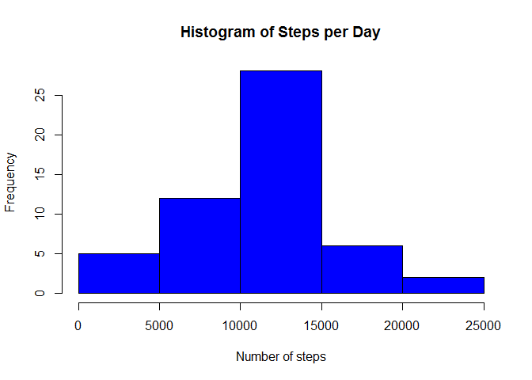
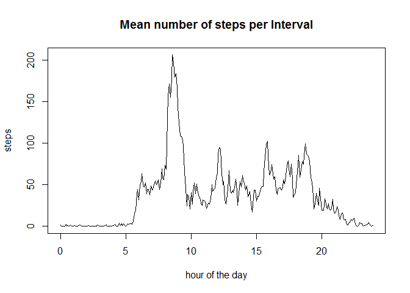
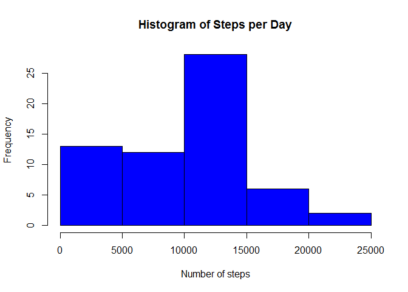
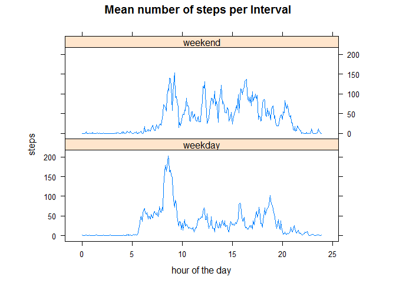

# Reproducible Research: Peer Assessment 1


## Loading and preprocessing the data
- Load data

```r
data=read.csv("activity.csv", stringsAsFactors = FALSE)
```

- Convert interval "numbers" to hours of the day

```r
data$interval = data$interval %/% 100 + (data$interval %% 100) / 60 
```

## What is mean total number of steps taken per day?
- Aggregate data per day and plot histogram

```r
stepsPerDay=aggregate(data$steps, list(data$date), sum)
hist(stepsPerDay$x, main="Histogram of Steps per Day", xlab="Number of steps", col="blue")
```

<!-- -->

- Calculate and print mean and median values of steps per day

```r
paste("Mean: ", as.character(mean(stepsPerDay$x, na.rm = T)), sep="")
```

```
## [1] "Mean: 10766.1886792453"
```

```r
paste("Median: ", as.character(median(stepsPerDay$x, na.rm = T)), sep="")
```

```
## [1] "Median: 10765"
```

## What is the average daily activity pattern?
- Aggregate data per interval and plot average number of steps

```r
stepsPerInterval=aggregate(data$steps, list(data$interval), mean, na.rm = T)
plot(stepsPerInterval[,1], stepsPerInterval[,2], main="Mean number of steps per Interval", xlab="hour of the day", ylab="steps", type="l")
```

<!-- -->

- Calculate and print time of day (i.e. interval) with maximum value

```r
maxInterval=data$interval[which.max(stepsPerInterval[,2])]
paste("Interval: ", as.character(maxInterval-maxInterval%%1), ":", as.character(maxInterval%%1*60), " (", as.character(which.max(stepsPerInterval[,2])), "th 5-minute interval of the day)", sep="")
```

```
## [1] "Interval: 8:35 (104th 5-minute interval of the day)"
```

## Imputing missing values
- Calculate and print number of missing values (NAs)

```r
paste("Number of NAs: ", as.character(sum(is.na(data$steps))), sep="")
```

```
## [1] "Number of NAs: 2304"
```

- Interpolate missing values with na.approx (set first and last value to 0, otherwise boundaries won't be interpolated)

```r
library(zoo)
```

```
## Warning: package 'zoo' was built under R version 3.3.2
```

```
## 
## Attaching package: 'zoo'
```

```
## The following objects are masked from 'package:base':
## 
##     as.Date, as.Date.numeric
```

```r
data_imp = data
data_imp[1,1] = 0
data_imp[17568,1] = 0
data_imp$steps=na.approx(data_imp$steps)
```

- Aggregate interpolated data per day and plot histogram

```r
stepsPerDay_imp=aggregate(data_imp$steps, list(data_imp$date), sum)
hist(stepsPerDay_imp$x, main="Histogram of Steps per Day", xlab="Number of steps", col="blue")
```

<!-- -->

- Calculate and print mean and median values of interpolated steps per day

```r
paste("Mean: ", as.character(mean(stepsPerDay_imp$x)), sep="")
```

```
## [1] "Mean: 9354.22950819672"
```

```r
paste("Median: ", as.character(median(stepsPerDay_imp$x)), sep="")
```

```
## [1] "Median: 10395"
```

## Are there differences in activity patterns between weekdays and weekends?
- Identify weekdays and weekends (October 1, 2012 was a monday)

```r
days=rep(rep(1:7, each=288), times=9)
days=days[1:(61*288)]
data_imp$typeOfDay = as.character(days)
data_imp$typeOfDay[data_imp$typeOfDay == "1" | data_imp$typeOfDay == "2" | data_imp$typeOfDay == "3" | data_imp$typeOfDay == "4" | data_imp$typeOfDay == "5"] = "weekday"
data_imp$typeOfDay[data_imp$typeOfDay == "6" | data_imp$typeOfDay == "7"] = "weekend"
data_imp$typeOfDay = factor(data_imp$typeOfDay)
```

- Plot average number of steps per interval for weekdays and weekends

```r
stepsPerIntervalAndTypeOfDay=aggregate(data_imp$steps, list(data_imp$interval, data_imp$typeOfDay), mean)
library(lattice)
xyplot(x ~ Group.1 | Group.2, data = stepsPerIntervalAndTypeOfDay, aspect = 1/3, main="Mean number of steps per Interval", xlab="hour of the day", ylab="steps", type = "l")
```

<!-- -->
